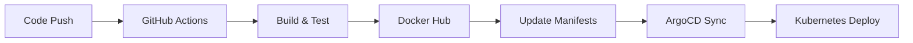

# Complete CI/CD Pipeline Setup - SUMMARY

## What Was Created

I've set up a comprehensive CI/CD pipeline for your Event Booking application with the following components:

### **File Structure Created:**
```
Event Booking/
├── .github/
│   └── workflows/
│       ├── ci-cd-pipeline.yml      # Main CI/CD pipeline
│       ├── pr-checks.yml           # Pull request validation
│       ├── manual-deploy.yml       # Manual deployment trigger
│       └── environment-sync.yml    # Environment synchronization
├── scripts/
│   └── setup-ci-cd.sh             # Setup helper script
└── CI-CD-README.md                 # Detailed documentation
```

### **Automated Workflows:**

1. **Main CI/CD Pipeline** (`ci-cd-pipeline.yml`)
   - Detects changes in backend/frontend
   - Runs tests and builds Docker images
   - Pushes to Docker Hub with smart tagging
   - Auto-updates GitOps manifests
   - Triggers ArgoCD deployment

2. **Pull Request Validation** (`pr-checks.yml`)
   - Validates code quality
   - Runs security scans
   - Tests Docker builds

3. **Manual Deployment** (`manual-deploy.yml`)
   - Deploy specific versions
   - Environment selection (dev/test/prod)
   - Component selection (backend/frontend/all)

4. **Environment Sync** (`environment-sync.yml`)
   - Promote releases between environments
   - Copy image tags from one env to another

## **Complete GitOps Flow:**



1. **Developer pushes code** → Triggers GitHub Actions
2. **GitHub Actions builds** → Pushes to Docker Hub
3. **Auto-updates manifests** → In GitOps repository
4. **ArgoCD detects changes** → Deploys automatically
5. **Application runs** → In Kubernetes cluster

## **Required Setup Steps:**

### 1. **GitHub Secrets** (Use the setup script):
```bash
./scripts/setup-ci-cd.sh
```

Or manually add these secrets in GitHub:
- `DOCKER_USERNAME` - Your Docker Hub username
- `DOCKER_PASSWORD` - Your Docker Hub password/token
- `GITOPS_TOKEN` - GitHub Personal Access Token

### 2. **Docker Hub Repositories:**
Create these repositories in Docker Hub:
- `akpadetsi/event-booking-backend`
- `akpadetsi/event-booking-frontend`

### 3. **Repository Structure:**
Ensure your repositories are set up as planned:
- `cloudenochcsis/event-booking-app` (this repo)
- `cloudenochcsis/gitops-k8s-manifests` (manifests repo)
- `cloudenochcsis/terraform-aks-infra` (infrastructure repo)

## **Image Tagging Strategy:**

- **Main branch**: `main-a1b2c3d` + `latest`
- **Feature branches**: `feature-branch-a1b2c3d`
- **Pull requests**: `pr-123-a1b2c3d`
- **Manual deploys**: Custom tags

## **Key Features:**

- **Smart Change Detection** - Only builds what changed
- **Parallel Builds** - Backend and frontend build simultaneously
- **Multi-Architecture** - Supports ARM64 and AMD64
- **Security Scanning** - Trivy vulnerability scans
- **Build Caching** - Faster subsequent builds
- **GitOps Integration** - Automatic manifest updates
- **Environment Management** - Dev/Test/Prod workflows
- **Manual Controls** - Deploy specific versions anytime
- **Rollback Ready** - Easy rollback capabilities

## **Next Steps:**

1. **Run the setup script:**
   ```bash
   cd "Event Booking"
   ./scripts/setup-ci-cd.sh
   ```

2. **Create your Docker Hub repositories**

3. **Push this code to your `event-booking-app` repository**

4. **Make a test commit** - The pipeline will automatically:
   - Build your Docker images
   - Push to Docker Hub
   - Update your manifest files
   - Trigger ArgoCD deployment

5. **Monitor the deployment** in GitHub Actions and ArgoCD

## **Testing the Pipeline:**

1. Make a small change to the backend or frontend
2. Commit and push to the main branch
3. Watch GitHub Actions build and deploy
4. Check ArgoCD for automatic sync
5. Verify the application is updated in Kubernetes

The entire process from code commit to live deployment should take 5-10 minutes!

---

**Your Event Booking application now has a complete, production-ready CI/CD pipeline!**
